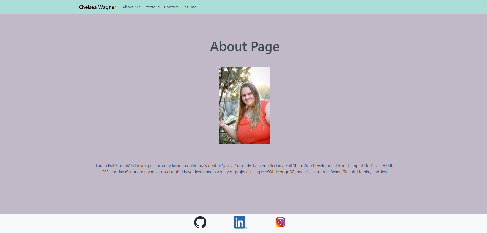

# Portfolio

## Description

- This is a portfolio which is a single page application using REACT.
- The viewer is able to view an about me page, a page with all the projects, a page for contact and a page for resume.

## Table of Contents

- [Features](#features)
- [Installation](#installation)
- [Usage](#usage)
- [Contributing](#contributing)
- [License](#license)
- [Support](#support)
- [Credits](#credits)

## Features

The Portfolio utilizes the following:

- React: used to develop the application
- Bootstrap: for CSS
- Vite: for improved developer experience

## Installation

To install this application you need to go to the following website: https://main--velvety-syrniki-73dbbe.netlify.app

## Usage

    - This is a screenshot of the homepage of the portfolio

## Contributing

    Contributions are welcome.

## License

    MIT

## Support

    If you have any questions or problems with the Application, please create an issue on the GitHub repository: https://github.com/caf62219/cw-react-portfolio.

## Credits

    Donnie Rawlings: https://github.com/drawlin22/
    Kyle Jocoy: https://github.com/Kylyote/
    Colton Firestone: https://github.com/ColtonMakesStuff
    Nedda Elsayed: https://github.com/Lven-Nemsy
